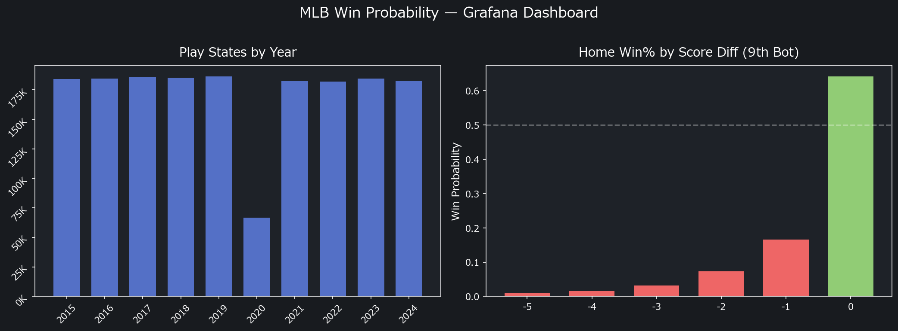

# MLB Win Probability Engine

イニング・アウト・走者・点差を入力すると、**ホーム勝率・局面の重要度・戦術提案**をリアルタイムで返すエンジン。

**[Live Demo](https://mlb-wp-engine.streamlit.app/)** | English / 日本語

---

**5 エンジン + アンサンブル構成：**

| Engine | Approach |
|--------|----------|
| **v1** | RE24 + Markov Chain + Normal 近似（Optuna 最適化済み） |
| **v2** | 10 年分 MLB 実データの経験的 WP テーブル + Markov Chain フォールバック |
| **LightGBM (state)** | 勾配ブースティング（25 特徴量、367K play states で学習） |
| **LightGBM (Statcast + FanGraphs)** | **165 特徴量**（Statcast 76 + FG 投手 46 + FG 打者 35 + 走塁守備 8）+ Optuna 50 trial |
| **Bayesian Hierarchical** | NumPyro SVI — **Statcast LightGBM ベース** + チーム力・球場・時代効果 + **90% 信用区間** |

5 エンジンを **inverse-Brier 加重アンサンブル** + **Isotonic Regression キャリブレーション**で統合。
学習・検証データは BigQuery から取得。FanGraphs / Savant の共有データは **[mlb-data-pipeline](https://github.com/yasumorishima/mlb-data-pipeline)**（`mlb_shared` データセット）で一元管理。

### Bayesian Hierarchical Model

ESPN / FanGraphs にない独自機能：**WP に不確実性の幅（信用区間）がつく**。

```
logit(WP) = logit(StatcastLGBM_pred)     ← Statcast 76 特徴量 LightGBM 予測値
           + α_home - α_away              ← チーム力（階層事前分布、30 チーム）
           + β_park                        ← 球場効果（ベイズ縮小推定）
           + γ_season                      ← 時代効果（ランダムウォーク、2015–2024）
           + κ × LI × (α_home - α_away)   ← レバレッジ × チーム力交互作用
```

- **Bayesian stacking**: LightGBM が投球・打球・バットトラッキング・FanGraphs 打者/投手指標等 **165 特徴量**を処理、ベイズ層がチーム力・球場・時代効果 + 不確実性を上乗せ
- 同じゲーム状態でもヤンキース vs オリオールズとオリオールズ vs ヤンキースで WP が異なる
- クアーズフィールドの球場効果が過学習なく反映される
- 序盤は幅広い信用区間 → 終盤は収束（レバレッジに応じた不確実性表現）
- NumPyro SVI（変分推論）で 172 万行に対応

## Features

- **Win Probability**: Home team win probability given inning, outs, runners, score
- **Bayesian Credible Interval**: 90% CI on WP (Statcast LightGBM + Bayesian stacking) — uncertainty widens in high-leverage, close-game situations
- **Conformal Prediction Interval**: 90% coverage interval (Split Conformal on 182K holdout plays)
- **Leverage Index**: How critical the current plate appearance is (1.0 = average, 4.0+ = critical)
- **WPA (Win Probability Added)**: WP change from a single play
- **Tactical Recommendations**: RE24-based evaluation of 8 tactical options (bunt, steal, squeeze, etc.)
- **Matchup Adjustment**: Fine-tune WP with batter OPS and pitcher ERA
- **AI Commentary (Gemini 2.5 Flash)**: Natural language game situation analysis with automated quality evaluation
- **Live Feed**: Real-time game state + pitch/hit data via MLB Stats API (auto-refresh every 30s)
- **Preset Scenarios**: 6 pre-built game situations for quick analysis
- **Bilingual UI**: English / Japanese toggle

## Quick Start

### FastAPI

```bash
pip install -r requirements.txt
uvicorn api:app --reload
# → http://localhost:8000/docs
```

### Docker

```bash
docker compose up --build
# → http://localhost:8001/docs
```

### Streamlit Dashboard

```bash
streamlit run streamlit_app.py
```

## Grafana Dashboard

[MLB Win Probability](https://yasumorishima.grafana.net/public-dashboards/8cf85d216d6e47068c3dcc7e807ac337) — Situation-based win expectancy analysis from 367K+ play states (2015–2024). Connected to BigQuery `data-platform-490901.mlb_shared` + `mlb_wp`.



## API Endpoints

### `GET /wp` — Win Probability + LI + Tactics

```bash
# 9th inning, bottom, 2 outs, bases loaded, tie game
curl "http://localhost:8000/wp?inning=9&top_bottom=bottom&outs=2&runner1=1&runner2=1&runner3=1&score_diff=0"
```

Response:
```json
{
  "win_probability": 0.93,
  "leverage_index": 8.6,
  "leverage_label": "Very High",
  "tactics": [...]
}
```

### `GET /wp/commentary` — AI Commentary (Gemini 2.5 Flash)

```bash
# 9th inning drama with AI analysis
curl "http://localhost:8000/wp/commentary?inning=9&top_bottom=bottom&outs=2&runner1=1&runner2=1&runner3=1&score_diff=0&lang=JA"
```

Response:
```json
{
  "win_probability": 0.93,
  "leverage_index": 8.6,
  "ai_commentary": "9回裏2アウト満塁、同点という...",
  "quality_evaluation": {
    "score": 95,
    "pass": true,
    "checks": {"mentions_wp": true, "mentions_li": true, ...}
  },
  "model": "gemini-2.5-flash",
  "lang": "JA"
}
```

### `GET /commentary/info` — Commentary System Metadata

```bash
curl "http://localhost:8000/commentary/info"
```

Returns prompt version, quality criteria, and available versions (similar to `/model/info` in [baseball-mlops](https://github.com/yasumorishima/baseball-mlops)).

### `GET /wp/play` — WPA for a Single Play

```bash
# Before: Bot 9, 1 out, runner on 2nd, tie → After: Bot 9, 1 out, runners 1st & 3rd, tie
curl "http://localhost:8000/wp/play?before_inning=9&before_top_bottom=bottom&before_outs=1&before_runner2=1&before_score_diff=0&after_inning=9&after_top_bottom=bottom&after_outs=1&after_runner1=1&after_runner3=1&after_score_diff=0"
```

### `GET /re24` — RE24 Table

```bash
# MLB environment (default)
curl "http://localhost:8000/re24"

```

### `GET /wp/scenario` — Preset Scenarios

```bash
curl "http://localhost:8000/wp/scenario?name=ninth_inning_drama"
curl "http://localhost:8000/wp/scenario?name=walkoff_chance"
```

Available scenarios: `ninth_inning_drama`, `game_start`, `rally_7th`, `tied_8th`, `walkoff_chance`, `comfortable_lead`

## Technical Background

### RE24 (Run Expectancy Matrix)

24 base-out states (8 runner configurations × 3 out states), each with an expected number of runs to score in the remainder of the inning. Based on MLB 2010-2019 average data. Scaled linearly for different scoring environments.

### Win Probability

5 エンジン構成（詳細は [Model Validation](#model-validation精度検証) セクション参照）:
- **v1**: Normal 近似 + Optuna 最適化（5 パラメータ）
- **v2**: 実データ WP テーブル（10 年分）+ Markov Chain フォールバック
- **LightGBM (state)**: 勾配ブースティング（25 特徴量）
- **LightGBM (Statcast + FG + Fielding)**: 165 特徴量（58 → 165 拡張、学習中）、58 特徴量版 Brier 0.1544（ベンチマーク比 +1.90%）
- **Bayesian Hierarchical**: Statcast LightGBM ベース + チーム力・球場・時代効果 + 90% 信用区間

アンサンブルで統合し、Isotonic Regression でキャリブレーション補正。

### Leverage Index

For each of 9 representative plate appearance outcomes (strikeout, single, double, HR, walk, etc.), calculates the WP change. LI = expected |WP change| / league average |WP change per PA| (≈0.035).

| LI Range | Label | Meaning |
|----------|-------|---------|
| < 0.5 | Low | Routine situation |
| 0.5–1.5 | Medium | Average importance |
| 1.5–3.0 | High | Key moment |
| 3.0+ | Very High | Game-defining |

### Tactical Recommendations

Evaluates 8 tactics by comparing expected RE24 values:
- Sacrifice Bunt / Steal 2B / Steal 3B / Intentional Walk
- Pitching Change / Pinch Hitter / Hit and Run / Squeeze Play

Each tactic has preconditions (e.g., steal requires a runner) and a success probability. The expected RE24 delta determines the recommendation.

## AI Commentary Architecture

Gemini 2.5 Flash を使ったリアルタイム状況解説機能。WP エンジンの構造化データ（勝利確率・レバレッジ指数・RE24・作戦提案・What-If 分析）を LLM に渡し、データに基づいた自然言語解説を生成。

### データフロー

```
Game State (inning, outs, runners, score)
    ↓
WP Engine (Markov Chain + RE24)
    ↓ full_analysis()
┌─────────────────────────────────────────┐
│ WP: 87.1%  LI: 11.19  RE24: 1.541     │
│ Tactics: [Hit and Run: Recommended]     │
│ What-If: HR→98.2%, K→83.4%, 1B→95.1%  │
└─────────────────────────────────────────┘
    ↓ Structured prompt (v2)
Gemini 2.5 Flash API
    ↓
Natural language commentary
    ↓
Quality Evaluation (6 criteria, 100pt)
    ↓
W&B Logging (latency, tokens, quality score)
```

### MLOps Integration

[baseball-mlops](https://github.com/yasumorishima/baseball-mlops) と同じ MLOps 設計思想を LLM 解説生成に適用：

| baseball-mlops (ML model) | mlb-win-probability (LLM commentary) |
|---|---|
| Model versioning (W&B Artifact + production alias) | Prompt versioning (`PROMPT_REGISTRY` + `PROMPT_VERSION`) |
| MAE evaluation (prediction vs actual) | Quality evaluation (6-criteria rule-based scoring, 100pt) |
| W&B experiment tracking (MAE, hyperparams) | W&B tracking (quality score, latency, token count, prompt version) |
| `/model/info` endpoint | `/commentary/info` endpoint |
| APScheduler model cache (6h refresh) | Session-based commentary cache |
| `continue-on-error` (non-blocking GCP/Discord) | Non-blocking W&B logging |

### Quality Evaluation

解説が分析データを適切に活用しているかを自動スコアリング：

| Criterion | Weight | Check |
|---|---|---|
| Win Probability 言及 | 25pt | 勝利確率の数値またはキーワード |
| Leverage Index 言及 | 20pt | プレッシャー/重要度への言及 |
| Run Expectancy 言及 | 15pt | 期待得点/得点可能性への言及 |
| What-If 言及 | 20pt | 次のプレイ別の WP 変動への言及 |
| Tactics 言及 | 10pt | 推奨作戦がある場合の言及 |
| 適切な長さ | 10pt | JA: 100-600文字 / EN: 150-800文字 |

**60点以上で PASS**。品質スコアは W&B に時系列で記録され、プロンプト改善のフィードバックループを形成。

### Setup

```bash
# Google AI Studio で無料 API キーを取得
# https://aistudio.google.com/apikey

# 環境変数に設定
export GEMINI_API_KEY="your-api-key"

# Streamlit Cloud の場合は secrets.toml に設定
# GEMINI_API_KEY = "your-api-key"

# W&B トラッキングを有効にする場合（任意）
export WANDB_API_KEY="your-wandb-key"
```

## Model Validation（精度検証）

367K+ play states + 6.8M Statcast pitches（2015–2024、10シーズン）を使って 5 つの WP エンジンを定量検証し、最良のアンサンブルを構築しています。

### Statcast WP ベンチマーク（2024 holdout, 182K at-bats）

| Model | Brier ↓ | BSS ↑ | LogLoss ↓ | ECE ↓ |
|-------|---------|-------|-----------|-------|
| MLB ベンチマーク `home_win_exp` | 0.1574 | 0.3706 | 0.4688 | 0.0153 |
| **LightGBM (Statcast)** | **0.1544** | **0.3825** | **0.4610** | **0.0067** |
| vs MLB ベンチマーク | **+1.90%** | | | |

**165 特徴量**（Statcast 76: 投球速度・変化量・打球・バットトラッキング・ゾーン・軌道等 + FanGraphs 投手 46: Stuff+/SIERA/ERA-/ゾーン別制球等 + FanGraphs 打者 35: wRC+/選球眼/打球傾向/走塁等 + 走塁守備 8: sprint speed/OAA/catcher pop time・arm strength）、Optuna 50 trial。MLB Stats API live feed からリアルタイム取得可能。

### データ基盤（BigQuery）

全データは **BigQuery** に格納。学習・検証パイプラインは BQ から直接取得。

> **共有データ基盤**: FanGraphs / Savant の生データは [mlb-data-pipeline](https://github.com/yasumorishima/mlb-data-pipeline) で取得・管理し、`mlb_shared` データセットに格納。

| Table | Rows | Description |
|-------|------|-------------|
| `mlb_wp.play_states` | 367,564 | ゲーム状態（イニング・アウト・走者・点差 → 勝敗）— WP 固有 |
| `mlb_shared.statcast_pitches` | 6,838,542 | **Statcast 全投球データ**（2015–2024、pybaseball 全 118 カラム + computed 4 = 122 列、4.77 GB） |
| `mlb_shared.park_factors` | 329 | 球場パークファクター（savant-extras） |
| `mlb_shared.fg_batting` | ~6,000/年 | **FanGraphs 打者シーズン成績**（全カラム、wRC+/選球眼/打球傾向/走塁/WAR 等） |
| `mlb_shared.fg_pitching` | ~4,000/年 | **FanGraphs 投手シーズン成績**（全カラム、Stuff+/SIERA/ERA-/ゾーン制球/WAR 等） |
| `mlb_shared.fg_pitcher_plus` | ~2,500/年 | **Stuff+/Location+/Pitching+** 球種別（2020+） |
| `mlb_shared.sprint_speed` | ~500/年 | **Statcast スプリント速度**（打者走力、hp_to_1b、bolts、2015+） |
| `mlb_shared.oaa` | 2,428 | **Statcast OAA**（7 ポジション別 Outs Above Average、2016+） |
| `mlb_shared.oaa_team` | 270 | **チーム OAA 集計**（チーム×シーズン別の合計/平均 OAA） |
| `mlb_shared.catcher` | 702 | **Statcast 捕手能力**（pop time、arm strength、exchange time、2015+） |

> 全共有テーブルは [mlb-data-pipeline](https://github.com/yasumorishima/mlb-data-pipeline) が毎週月曜に自動更新。`mlb_wp` にはWP固有の `play_states` のみ残存。

Statcast データは pybaseball 全 118 カラム + computed 4 = **122 カラム**を保持（投球速度・変化量・打球速度・発射角度・xwOBA・バットトラッキング・選手年齢・ストライクゾーン・リリースポイント・投球軌道・MLB ベンチマーク WP 等）。WP モデル学習時は**打席結果のみ（`events IS NOT NULL`）**に絞り、約 172 万行で学習。

### エンジン構成

| Engine | Approach | 特徴 |
|--------|----------|------|
| **v1 (Normal)** | Markov Chain + Normal 近似 + Optuna 最適化 | 5 パラメータ、数式ベース |
| **v2 (Empirical)** | 実データ WP テーブル + Markov Chain フォールバック | 10 年分の経験的確率、未知状態は Markov で補完 |
| **LightGBM (state)** | 勾配ブースティング（25 特徴量、ゲーム状態のみ） | 状態変数ベースの ML |
| **LightGBM (Statcast + FG)** | 勾配ブースティング（**165 特徴量**: Statcast 76 + FG 投手 46 + FG 打者 35 + 走塁守備 8、Optuna 50 trial） | **リアルタイム対応、FG シーズン指標で打者・投手の質を反映** |
| **Bayesian Hierarchical** | Statcast LightGBM ベース + NumPyro SVI 階層モデル（チーム・球場・時代・レバレッジ） | **Bayesian stacking、90% 信用区間付き WP、チーム別強度・球場効果推定** |

### アンサンブル（inverse-Brier 加重）

[baseball-mlops](https://github.com/yasumorishima/baseball-mlops) の 5 モデルアンサンブルと同じ設計思想：

```
weight_i = 1 / brier_score_i
ensemble_pred = Σ(w_i × pred_i) / Σ(w_i)
```

さらに **Isotonic Regression** でキャリブレーション補正し、ECE（Expected Calibration Error）を削減。

### 検証パイプライン

```
BigQuery
├── mlb_wp.play_states (367K)       ── state-based engines ────┐
│     ↓ export_from_bq.py                                      │
│   v1 Normal / v2 Empirical / LightGBM(state)                 │
│     ↓                                                         │
│   train_wp_bayesian.py (NumPyro SVI, Statcast LightGBM base)  │
│     ↓                                                         │
│   Bayesian Hierarchical (Statcast + team/park/season/leverage)├→ 本番WP
│     ↓ 90% credible intervals                                  │
│                                                               │
│   Ensemble (inverse-Brier weighted, 5 engines)               │
│     ↓                                                         │
│   Leave-one-year-out CV (2015–2024)                          │
│                                                               │
├── mlb_shared.statcast_pitches (6.8M) ── Statcast engine ───┘
│     ↓ train_wp_statcast.py
│   LightGBM(Statcast+FG, 157 features, Optuna)
│     ↓
│   Benchmark: MLB home_win_exp (Statcast API)
│     ↓
│   Park factors (mlb_shared.park_factors)
└──────────────────────────────────────────────────┘
    ↓
results/ (JSON + posterior samples + calibrator.pkl)
    ↓
Streamlit (WP gauge + CI band) + Discord notification
```

### メトリクス

| Metric | Description |
|--------|-------------|
| Brier Score | 確率予測の代表的評価指標。mean((predicted - actual)²)、低いほど良い |
| Brier Skill Score | 常に 50% と予測するベースラインとの比較。正なら改善 |
| ECE | 予測値と実際の勝率のズレ。0 に近いほど校正が正確 |
| Log Loss | 確信度の高い誤予測を重く罰するスコアリングルール |

### v1 Optuna 最適化

Optuna（TPE sampler, 500 trial）で Brier Score **+3.85%** 改善（0.1651 → 0.1587）。

| Parameter | Description | Value |
|-----------|-------------|-------|
| `variance_factor` | 得点分布の分散係数 | 3.66 |
| `scoring_factor` | 9 回裏同点時のサヨナラ確率 | 0.87 |
| `behind_lambda_mult` | 9 回裏ビハインド時 Poisson λ倍率 | 0.45 |
| `top9_lambda_mult` | 9 回表ホームリード時 Poisson λ倍率 | 0.67 |
| `extras_win_prob` | 延長戦ホーム勝率 | 0.41 |

### ワークフロー

```bash
# 3エンジン比較 + アンサンブル + 年次CV（BQから自動データ取得）
gh workflow run "Build WP v2" \
  --repo yasumorishima/mlb-win-probability \
  -f memo="ensemble + calibration + CV" \
  -f step=wp_v2_full

# v1 単体の Optuna 最適化
gh workflow run "Validate WP Model" \
  --repo yasumorishima/mlb-win-probability \
  -f memo="2024 full season" \
  -f season=2024 -f optimize=true -f n_trials=500
```

### Cloud Run API

| 項目 | 値 |
|---|---|
| URL | デプロイ済み（認証付き） |
| Swagger UI | ローカル起動: `http://localhost:8001/docs` |
| Artifact Registry | `us-central1-docker.pkg.dev/data-platform-490901/apis/mlb-win-probability-api` |
| メモリ | 256Mi |

## Roadmap

### Phase 1: 基盤構築 ✅
- [x] WP エンジン v1（Markov Chain + Normal 近似 + Optuna 5 パラメータ最適化）
- [x] FastAPI + Streamlit ダッシュボード（バイリンガル、ライブフィード、What-If）
- [x] BigQuery データ基盤（367K+ play states、BQ エクスポートで秒単位データ取得）
- [x] Cloud Run API デプロイ（認証付き、Artifact Registry）
- [x] Grafana ダッシュボード（BQ 接続、公開）

### Phase 2a: State-based 精度追い込み ✅
- [x] v2 エンジン構築（10 年分実データ WP テーブル + Markov Chain フォールバック）
- [x] LightGBM(state) エンジン構築（25 特徴量、Optuna 最適化）
- [x] 3 エンジン比較パイプライン（GitHub Actions、BQ → 自動比較）
- [x] Isotonic Regression キャリブレーション補正
- [x] Leave-one-year-out CV（2015–2024、全 10 年で一貫して改善）

### Phase 2b: Statcast 精度追い込み ✅
- [x] Statcast 全投球データ BQ ロード（6,838,542 行、pybaseball **全 118 カラム** + computed 4 = **122 列、4.77 GB**）
- [x] **165 特徴量エンジニアリング**（Statcast 76: 投球・打球・バットトラッキング・ゾーン・軌道 + FanGraphs 投手 46: Stuff+/SIERA/ERA-/ゾーン制球 + FanGraphs 打者 35: wRC+/選球眼/打球傾向/走塁/WAR）
- [x] GitHub Actions ワークフロー（`Train Statcast WP Model` + `Reload Statcast BQ`）
- [x] 全カラム欠損ガード（`_safe_col()` ヘルパー）
- [x] **LightGBM Optuna 50 trial 完了（Brier 0.1544、ベンチマーク比 +1.90%）**
- [x] **ランタイムエンジン実装（`win_probability_statcast.py`）**
- [x] **MLB Stats API から投球・打球データ取得（リアルタイム + リプレイ対応）**
- [x] **Conformal Prediction（2024 ホールドアウト 182K plays、90% coverage 90.01%）**
- [ ] Streamlit アプリ統合（リプレイ + ライブ表示）

### Phase 2c: Statcast 予測区間 + アンサンブル + Bayesian 統合 🔄（現在）
- [x] ~~NumPyro 階層モデル（game-state のみ）→ Brier 0.1648、Statcast 未使用のため不採用~~
- [x] ~~NGBoost Bernoulli → 二値分類では p(1-p) しか出ず認識論的不確実性なし~~
- [x] ~~Quantile Regression LightGBM → 二値ターゲット（0/1）では分位点が 0 or 1 に収束、不適合~~
- [x] **Conformal Prediction 正式採用**（Split Conformal、2024 ホールドアウト 182K plays、90% coverage 90.01%）
- [x] **アンサンブル**（v1+v2+Statcast、inverse-Brier 加重、**Brier 0.1605**、`Train Ensemble WP` ワークフロー）
- [x] Streamlit エンジン比較セクション（v1 / Statcast / Ensemble + 90% 区間表示）
- [x] **Bayesian + Statcast 統合**（Statcast LightGBM 予測をベースに階層ベイズ上乗せ、チーム・球場・時代効果 + 90% 信用区間）
- [x] **BQ 全カラムリロード**（pybaseball 全 118 列 + computed 4 = 122 列、4.77 GB）
- [x] **76 特徴量に拡張**（babip/iso/delta_run_exp/age/sz/spin_axis/release_pos/trajectory 追加）
- [x] **FanGraphs 全指標統合（165 特徴量）** — 投手 46 指標（Stuff+/SIERA/ERA-/ゾーン制球等）+ 打者 35 指標（wRC+/選球眼/打球傾向/走塁/WAR 等）を BQ マスタ経由で投球単位データに join
- [x] **走塁・守備マスタ統合（165 特徴量）** — Statcast sprint speed（打者走力）+ OAA チーム集計（守備力）+ catcher pop time/arm strength（捕手能力）追加
- [x] **走塁・守備 BQ ロード + カバレッジ検証完了** — sprint 87.2% / team OAA 83.3% / catcher 86.0%（2015 はデータなし、2016-2024 は 93-99%）
- [ ] **165 特徴量 Statcast+FG+Fielding モデル学習中** ← 現在ここ
- [ ] Conformal Prediction 再計算
- [ ] Bayesian（Statcast base + 階層）学習
- [ ] Ensemble（v1+v2+Statcast+Bayesian）学習
- [ ] 本番アンサンブル確定（最良エンジン構成を決定）

### Phase 3: AI Commentary 🔄（現在）
- [x] Gemini 2.5 Flash 解説生成（`/wp/commentary` エンドポイント）
- [x] プロンプトバージョニング（`PROMPT_REGISTRY`）+ 品質自動評価（100pt）
- [x] W&B 実験追跡（レイテンシ・トークン数・品質スコア）
- [ ] **Gemini API キー設定 + Streamlit Cloud 実動作確認**
- [ ] プロンプト v3 改善（v2 の品質スコア分析結果ベース）

### Phase 4: データ基盤統合 ✅
- [x] **[mlb-data-pipeline](https://github.com/yasumorishima/mlb-data-pipeline) 構築**（baseball-mlops との共有 BQ データ基盤、`mlb_shared` データセット）
- [x] `statcast_pitches` 参照先を `mlb_shared` に切り替え
- [x] `mlb_wp.statcast_pitches` → `mlb_shared.statcast_pitches` 移行
- [x] FG stats / fielding テーブルを `mlb_shared` に統合（テーブル名統一、WP独自fetchスクリプト削除）
- [x] `mlb_wp` に残るのは `play_states` のみ

### Phase 5: 統合デプロイ
- [ ] 本番エンジン切り替え（アンサンブル or 最良エンジン）
- [ ] Cloud Run 再デプロイ（アンサンブル + AI Commentary + BQML 統合）
- [ ] W&B Dashboard 構築（品質スコア・Brier Score の時系列可視化）

## License

MIT
