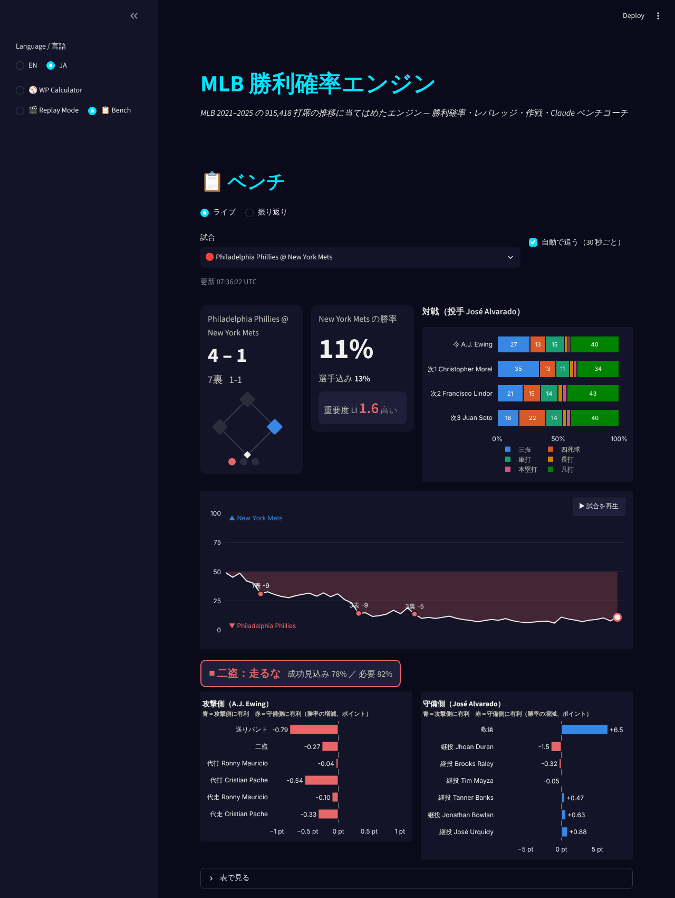

# MLB Win Probability Engine

イニング・アウト・走者・点差（とカウント）から、**ホームの勝利確率・局面の重要度（Leverage Index）・作戦ごとの勝率の増減**を返すエンジンと、その数字を読んで次の 1 球の前に作戦を提案する **Claude ベンチコーチ**。

**[Live Demo](https://mlb-wp-engine.streamlit.app/)**（English / 日本語）

公開して動いているのは Streamlit デモだけです。FastAPI は手元で起動して使います。デモには API キーを置いていないので、デモからは Claude を呼びません。

---

## エンジン

MLB Stats API の play-by-play から作った打席ごとの遷移（2021〜2025 年・915,418 打席）に当てはめた、リーグ平均のマルコフモデルです（`wp_engine.py`、表は `engine_tables.json`）。

1. レギュラーシーズンの打席で、塁・アウトの状態ごとに「次の状態とその打席の得点」の分布を、表（ビジター攻撃）と裏（ホーム攻撃）で別に数える
2. そこから、半イニングの残りで何点入るかの分布を動的計画法で出す
3. 半イニングを再帰でたどって試合の勝率を出す（サヨナラ、延長の二塁走者〈2020 年以降のレギュラーシーズン。ポストシーズンは無し〉）
4. カウントの層：打席の結果の種類はカウントで変わり、種類ごとの遷移は変わらないとして、カウント別の勝率を出す（0-0 ではカウント無しの勝率と一致）

作戦は得点期待値でなく**勝率**で測ります。

| 作戦 | 出す数字 |
|---|---|
| 盗塁（二塁・三塁） | 損益分岐の成功率 |
| 送りバント | その状態で実際に起きたバントの結果の平均をとった勝率と、その増減 |
| 敬遠 | 打者を一塁に置いた後の勝率と、その増減（守備側から見る） |

### 2026 年（学習に使っていない年）での確認

| | Brier | log loss |
|---|---|---|
| このエンジン | 0.15845 | 0.47138 |
| 旧エンジン（手で合わせた正規近似） | 0.15970 | 0.47733 |
| ホーム勝率の定数 | 0.24976 | 0.69266 |

2026 年の 184,327 打席それぞれについて、打席前の勝率をその試合の勝敗で採点しました。7 回以降で 2 点差以内に限ると、旧エンジンとの Brier の差は −0.0045（試合単位のブートストラップで 95% 区間 −0.0073〜−0.0017）です。勝率帯ごとの数字は `reports/engine_check_2026.json` にあります。

**分かっている弱点**：勝率 0.3〜0.5 の帯で高めに出ます（2026 年は 3.3 ポイント。エンジンの学習に使った 2022〜2025 年でも、年により 0.8〜4.7 ポイント）。

### チームの強さを足した補正層（事前登録して 2026 年で確認）

エンジンは両チームをリーグ平均として扱います。そこで、エンジンの勝率と両チームの得失点差（前年と、その年のその日より前の試合）から勝率を出し直す補正層（ロジスティック回帰）を作り、2026 年で採点しました（`research/wp_layer/`。事前登録は採点の前に commit。凍結前の版を誤って 2026 年で走らせ、出力を読まずに消した件は事前登録の文書に書いてあります）。

| | Brier | log loss |
|---|---|---|
| エンジン | 0.15845 | 0.47138 |
| エンジンの勝率だけで較正し直したもの（対照） | 0.15831 | 0.47115 |
| **チームの強さを足した補正層** | **0.15680** | **0.46743** |

補正層は対照より Brier が 0.00151 小さく（試合単位のブートストラップで 95% 区間 −0.00253〜−0.00049）、エンジンより 0.00165 小さくなりました（−0.00270〜−0.00060）。事前登録した 2 つの仮説はどちらも支持されました。差の点推定は試合の序盤ほど大きく、序盤 3 分の 1 で −0.0026、終盤 3 分の 1 で −0.0006 です（区間は出していない参考値）。

0.3〜0.5 の帯の高めの偏りは、補正層でも対照（較正し直しただけ）と同じだけしか変わりません（帯での予測の平均の差 補正層−対照 +0.001、95% 区間 −0.0016〜+0.0036）。帯の偏りの原因がチームの強さだという見立ては、この結果では裏づけられていません。較正し直すことで帯の偏りがどれだけ縮むかは、1 シーズンでは区間が広く分かりません。詳細は [`research/wp_layer/RESULTS.md`](research/wp_layer/RESULTS.md) にあります。

事前登録で決めたとおり、補正層はアプリと API に入れました（係数は採点したものそのまま・`team_layer.py`）。レギュラーシーズンの試合では、ライブ表示とリプレイでエンジンの勝率と並べてチーム力込みの勝率を出し、`/wp/live/{gamePk}` は `team_layer` で返します。得失点差は MLB Stats API の日程から学習時と同じ規則（終わった試合だけ・継続試合は最初の日に 1 回・その日より前の試合・n/(n+30) で縮める）で作ります。2025 年の全 2,430 試合で学習時の値と一致し（差 0）、2026 年の採点の予測も再現することを `scripts/check_team_layer.py` で確かめています。カウントは使いません（学習が打席前の状態のため）。ポストシーズンの試合と、手で入力する分析には使いません。

### 選手を入れた層（事前登録して 2026 年で確認）

エンジンは全選手をリーグ平均として扱います。選手を入れた層（`research/player_layer/`）は、打者・投手・球場から打席の結果（三振・四球・単打・二塁打・三塁打・本塁打・凡打）の確率を出し（その日より前の成績だけを使う）、実際の打順で次に打つ打者たちと、その回に投げる投手（先発は 6 回まで、その後はブルペン）で、残りの全イニングの得点の分布を出して勝率にします。全員を平均にするとエンジンの値と一致することを確かめています。設計は 2021〜2025 年だけで行い（1 シーズンずつ外して採点）、2026 年は事前登録を凍結してから 1 回だけ採点しました。2026 年はこれまでにエンジンの確認・チーム補正層・盗塁研究で使っています。

| | Brier | log loss | 勝率 0.3〜0.5 の帯の偏り |
|---|---|---|---|
| エンジン | 0.15845 | 0.47138 | +3.26 ポイント |
| チームの強さを足した補正層 | 0.15680 | 0.46743 | +1.09 ポイント |
| **選手を入れた層** | **0.15676** | **0.46700** | +1.67 ポイント |

- 勝率：選手を入れた層はエンジンより Brier が 0.00169 小さく（試合単位のブートストラップで 95% 区間 −0.00310〜−0.00024）、事前登録した仮説は支持されました。
- その回にあと 1 点以上入るか：log loss がエンジンより 0.00146 小さく（−0.00198〜−0.00096）、支持されました。
- チーム補正層との差は −0.00003（−0.00098〜+0.00097）で、2026 年では区別できません（同じだという意味ではありません）。

詳細は [`research/player_layer/RESULTS_2026.md`](research/player_layer/RESULTS_2026.md) にあります。事前登録どおり、この層はベンチ画面の数字（代打・継投・バント・敬遠の比較）の土台にし、見出しの勝率は 2027 年の確認まで今のエンジンと補正層のままにします。

### 選手層とチーム補正を混ぜたもの（事前登録して 2026 年で確認）

選手を入れた層とチーム補正層を、それぞれ 2022〜2025 年の「学習に使っていない年の予測」で較正し直してから半々に混ぜたもの（BLEND）を、2026 年で 1 回だけ採点しました（`research/player_layer/RESULTS_BLEND_2026.md`）。2026 年で選手層とチーム補正がほぼ同じだと分かった後に設計したので、初見の検証ではありません。

| | Brier | 勝率 0.3〜0.5 の帯の偏り |
|---|---|---|
| チーム補正層 | 0.15680 | +1.09 ポイント |
| 選手を入れた層 | 0.15676 | +1.67 ポイント |
| 選手を入れた層を較正し直したもの | 0.15665 | +0.11 ポイント |
| **BLEND** | **0.15640** | +0.97 ポイント |

BLEND はチーム補正より Brier が 0.00039 小さい（95% 区間 −0.00089〜+0.00012）ものの、区間が 0 をまたぐため、事前登録した仮説はどちらも支持されませんでした（1 シーズンではこの大きさの差は決まらない、と事前に書いたとおりです）。見出しの勝率はチーム補正層のままです。

### ベンチの選択肢（ライブ表示）

試合中のライブ表示に「ベンチの選択肢」を出します（`bench_live.py`）。MLB Stats API のライブフィードから、今の打順・控えの野手・まだ投げていないブルペン（2025〜2026 年に主に先発した投手は除く）・両チームの次の打者を読み、選手を入れた層で選択肢ごとに「この回の得点期待値」「1 点以上入る確率」「攻撃側の勝率」を出します。

- 攻撃側：そのまま／送りバント／盗塁（その走者の成功見込みと損益分岐の成功率を並べて「走れ／走るな」）／代打（控えの全員を計算し、勝率の高い順に最大 6 人）／代走（今の走者より速い控え、最大 3 人）
- 守備側：敬遠／継投（ブルペンの全員を計算し、相手の勝率を下げる順に最大 6 人）

選手の成績は 2021〜2026 年のレギュラーシーズン（`research/player_layer/published/bench_snapshot.json`、2026-09-27 まで）で、古い年ほど軽く数え（1 年ごとに 0.6 倍。打席の結果の予測で log loss −0.00088）、左右の相性も入れています（−0.00064）。シーズン中は更新されません。サイドバーの「📋 Bench」を選ぶと、試合中の試合を自動で選び、30 秒ごとに更新する 1 画面になります（`bench_screen.py`、図は `bench_viz.py`）：塁とアウトの図、勝率と重要度（勝負所では光る）、今の打者と次の 3 人の結果の内訳（積み上げ棒）、試合の勝率の流れ（大きく動いた 3 プレーに印、「▶ 試合を再生」で線が伸びていく）、盗塁の「走れ／走るな」の札、作戦ごとの勝率の増減（棒）。表でも見られます。

代走は、走者の前年のスプリントスピードで余分な進塁（単打で二塁から生還・一塁から三塁、二塁打で一塁から生還）の確率を変えて計算します（2021〜2025 年で 1 シーズンずつ外して採点し、どれも速さを入れたほうが当たる：log loss −0.009〜−0.023）。盗塁の成功見込みは速さだけのモデルで、効きは小さい（−0.0006）ので目安です。守備固めとこの回より先の継投は考えていません。全員を平均の選手にするとエンジンのバント・敬遠の値と一致することを、570 の場面で確かめています（`research/player_layer/selftest_bench.py`）。

## データ

`scripts/build_states.py` が MLB Stats API から打席・走者・投球の表を作ります（GitHub Actions の `build-states.yml` を手動で実行し、Release `states-v1` に出力）。各試合で次を確かめ、どれかが合わない試合は捨てます。

- スコアを打席ごとに積み上げると最終スコアに一致する
- 各半イニングが 0 アウトで始まり、途中でアウト数が減らない
- 延長の二塁走者がルールどおり置かれている
- 盗塁と盗塁死の数がボックススコアと一致する

捨てた試合が 1% を超えたシーズンや、盗塁を投球に割り当てられた割合・捕手の記録が合わないシーズンは書き出しません。2021〜2026 年のレギュラーシーズンの全試合で、捨てた試合は 0 です。表を当てはめ直すときは `scripts/fit_engine.py` を使います。

## Claude ベンチコーチ

`strategist.py` が、局面とエンジンの数字（作戦ごとの損益分岐や勝率の増減）を Claude（`claude-opus-5-5`。混雑時はサーバー側のフォールバックで別のモデルが答えることがあります）に渡し、推奨する作戦・理由・使った数字を構造化出力で受け取ります。**Claude が「使った数字」として返した値と、理由の中の % の数字を、渡した数字と突き合わせ**、合わないものは画面と API の応答に出します。

- キー：環境変数 `ANTHROPIC_API_KEY`（または Streamlit secrets）。無ければ何も送りません
- 1 回の問い合わせは 1 リクエストです（SDK の再試行なし・60 秒で打ち切り。2026-10-15 の実測は 1 回 4〜7 秒）
- アプリでの上限は、サーバー全体で 1 日（UTC）`COACH_DAILY_LIMIT` 回（既定 30）と、1 セッション 10 回です（失敗した問い合わせも数えます）
- API の `/wp/advice` は `ADVICE_TOKEN` も必要です。リクエストに同じ値の `X-Advice-Token` ヘッダーが無ければ断ります（回数の上限は無いので、トークンは人に渡さないでください）

### 盗塁の成功を、統計モデルより当てられるか

Claude 自身の予測が役に立つかを、事前登録して確かめました（`research/steal_claude/`）。2026 年 7〜9 月の盗塁 1,843 件で比べた結果、**Claude 単独（log loss 0.4668）は統計モデル（0.4636）より悪く、モデルの予測値を渡した場合（0.4624）は数字の上ではわずかに良いものの、差 −0.0012（95% 区間 −0.0038〜+0.0013）で改善とは言えません**。事前登録した 2 つの仮説はどちらも支持されませんでした。詳細と Claude の全回答は [`research/steal_claude/RESULTS.md`](research/steal_claude/RESULTS.md) にあります。ベンチコーチは、エンジンの数字を言葉にして作戦をまとめる役として使っています。

## 使い方

### Streamlit

```bash
pip install -r requirements.txt
streamlit run streamlit_app.py
```

- 局面を入力するか、プリセット（9 回裏の満塁など 6 つ）を選ぶと、勝率・LI・作戦・次の打席の結果ごとの勝率が出ます
- **Live Games**：その日の試合を MLB Stats API から読み、進行中の局面をそのまま入力に反映できます（30 秒ごとの自動更新あり。終わった試合は反映しません）
- **Replay Mode**：過去の試合を 1 プレーずつ（自動再生もできます）たどり、各プレーの前後の勝率と WPA を見られます

### FastAPI

```bash
pip install -r requirements.txt
uvicorn api:app --reload
# → http://localhost:8000/docs
```

Docker なら `docker compose up --build` で `http://localhost:8001/docs` です（ホストの `ANTHROPIC_API_KEY` と `ADVICE_TOKEN` を渡します）。

| エンドポイント | 内容 |
|---|---|
| `GET /wp` | 勝率・打撃側の勝率・LI・残りの得点期待値・次の打席の結果ごとの勝率・作戦 |
| `GET /wp/play` | 1 プレーの前後の状態から WPA（`after_outs=3` は攻守交代） |
| `GET /wp/advice` | 上と同じ分析に Claude の推奨を付けたもの（キーとトークンが必要） |
| `GET /re24` | 24 の塁・アウト状態の得点期待値と、1 点以上入る確率 |
| `GET /wp/scenario` | プリセットの局面 |
| `GET /games/today` | その日の試合一覧（`date=YYYY-MM-DD`） |
| `GET /wp/live/{gamePk}` | 試合の現在の局面と勝率（レギュラーシーズンはチーム力込みの勝率 `team_layer` も） |

`/wp`・`/wp/play`・`/wp/advice` は `extra_runner=false` で延長の二塁走者なし（ポストシーズンと 2019 年以前）として計算します。7 イニングの試合は `scheduled_innings=7` を渡します。カウントは `balls` と `strikes` を両方渡したときだけ使います。

```bash
# 9 回裏 2 死満塁 同点
curl "http://localhost:8000/wp?inning=9&top_bottom=bottom&outs=2&runner1=1&runner2=1&runner3=1&score_diff=0"

# Claude の推奨（8 回裏 無死一塁 1 点ビハインド）
curl -H "X-Advice-Token: $ADVICE_TOKEN" \
  "http://localhost:8000/wp/advice?inning=8&top_bottom=bottom&outs=0&runner1=1&score_diff=-1&lang=JA"
```

### Leverage Index の目安

| LI | 表示 |
|---|---|
| 0.5 未満 | Low |
| 0.5〜1.5 | Medium |
| 1.5〜3.0 | High |
| 3.0 以上 | Very High |

## 旧版からの変更（2026-10）

- 以前の学習データ（Hugging Face `mlb_wp/play_states`）は、アウト数が全行 0、走者なしが 77% で使えないと分かったため、データを作り直し、エンジンも置き換えました。旧エンジン（v1/v2・LightGBM・ベイズ）と、それに基づく検証値は削除しました（比較用に `scripts/old_engine.py` だけ残しています。アプリと API は使いません）
- 解説は Gemini から Claude に替えました。`/wp/commentary` と `/commentary/info` は無くなり、`/wp/advice` に替わっています
- `runs_per_game`・`batter_ops`・`pitcher_era` による補正は無くなりました（エンジンは全員をリーグ平均として扱います）

## テスト

```bash
pip install -r requirements.txt pytest httpx
pytest tests/
```

## License

コードは MIT。データは MLB Stats API から取得しています（Data © MLB Advanced Media）。
